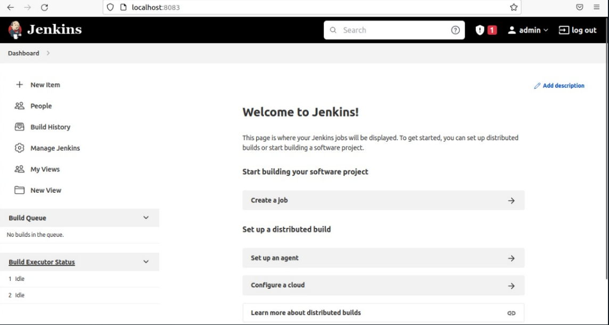

# Jenkins-Ansible Task on AWS

Create ansible script to configure application ec2(private)

- configure ansible to run over private ips through bastion (~/.ssh/config)

- write ansible script to configure ec2 to run  as jenkins slaves

- configure slave in jenkins dashboard (with private ip)

- create pipeline to deploy nodejs_example fro branch (rds_redis)

- add application load balancer to your terraform code to expose your nodejs app on port 80 on the load balancer

- test your application by calling loadbalancer_url/db and /redis

## Provision infrastructure on aws

```bash
terraform init
terraform plan --var-file prod.tfvars
terraform apply --var-file prod.tfvars
```

## Building jenkins image

```bash
docker build . -t jenkinsImg -f Dockerfile
docker run -d -p 8083:8080 -v /var/run/docker.sock:/var/run/docker.sock jenkinsImg
```




## SSH ****on private instance from jenkins container****

using ****jump host****

```bash
root@c3qh7b119408:~# mkdir .ssh
root@c3qh7b119408:~# cd .ssh
root@c3qh7b119408:~/.ssh# vi config
#####
Host bastion
    User ubuntu
    HostName 54.157.55.245  
    IdentityFile /root/.ssh/secretkey.pem

host app
   HostName  10.0.3.150
   user ubuntu
   ProxyCommand ssh bastion -W %h:%p
   identityFile /root/.ssh/secretkey.pem  

####
root@c3qh7b119408:~/.ssh# vi secretkey.pem
<<secret_key>>
root@c3qh7b119408:~/.ssh# chmod 400 secretkey.pem
root@c3qh7b119408:~/.ssh# ssh app
```


## Run Ansible playbook
create bastion server to access private (app) instance

```bash
ansible-playbook -i inventory --private-key /home/mohamed/secretkey.pem
```

create the node


